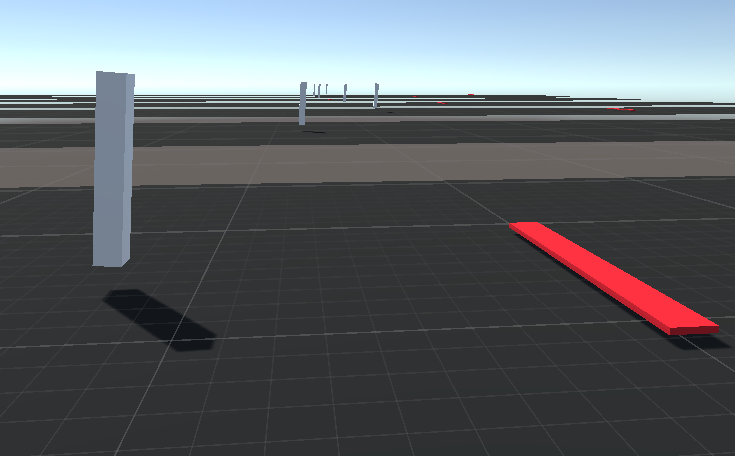

#Reinforcement Learning - Balancing Robot
My own implementation of Unity ml-agents. 
In this example the agent is a balancing robot, consisting of a body connected to two wheels by a revolute joint. The wheels are torque controlled. 
The goal is to move to the target (red line) without tipping over. The red line spawns randomly with an x-distance from the starting point. 
The agent is penalized for tipping over (-1), spending time (-0.1 per iteration), and awarded for moving forward (0.1 per iteration) and reaching the goal (1). 